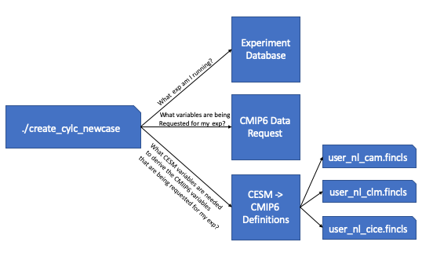

.. _faq:

Common questions and answers
============================

* :ref:`stop_midrun`

* :ref:`pause_run`

* :ref:`restart_when_stopped`

* :ref:`where_diags`

* :ref:`find_failure`

* :ref:`pp_failure`

* :ref:`where_are_my_files`

* :ref:`fincls`

.. _stop_midrun:

How do you stop a simulation once it has started?
-------------------------------------------------

There are a couple of ways to do this depended what your end goal may be.

*  If you want to stop a run to start over:
  
    *  With the gui open, right click on any task that is running and select the kill option.
 
    *  Then select the "Stop suite" button at the top.

    *  When you are ready to restart the simulation, click the "Run" button and select "Cold-start" to start the run up from the beginning.

*  If you want to stop a run to start it again later (much later - around 2-4 weeks):
  
    *  With the gui open, right click on any task that is running and select the kill option.
 
    *  Then select the "Stop suite" button at the top.

    *  When you are ready to restart the simulation, click the "Run" button and select "Restart" to continue where it left off.

.. _pause_run:

How do you pause a run in order to evaluate it and start it back up?
--------------------------------------------------------------------

*  Use this option as opposed to the :ref:`stop_midrun` option if you are expecting to start the run back up within 2 weeks. 

*  With the gui open, select the task you would like to pause at, right click it, and then select the "Hold" option.  More often you'll want to click on the cesm_run task after the next st_archive command (because you want to still archive the latest run).

*  When you are ready to continue the run, right click on the task and select the "Release" option.

.. _restart_when_stopped:

How do you restart a Cylc suite if it has stopped?
--------------------------------------------------

*  With the gui open, select the 'Run' button.

*  In the window that pops up, select the 'restart' option and then hit 'Start'

*  Do not select the cold-start option in this window unless you want to start the simulation from the beginning.   

.. _where_diags:

Where are my diagnostics copied to?
-----------------------------------

*  Where your diagnostics are copied over to are controlled by the last set of variables in your <case_dir>/postprocess/env_postprocess.xml file

*  By default, the root html link is http://webext.cgd.ucar.edu/.  The rest of the path is controlled by the GLOBAL_REMOTE_WEBDIR variable in the env_postprocess.xml file.  Everything after "/project/diagnostics/external/" will be the remainder of the path. 

*  For example, if you have <entry id="GLOBAL_REMOTE_WEBDIR" value="/project/diagnostics/external/B1850/b.e21.B1850.f09_g17.myCMIPrun/" />, you will find your diagnostics within the directory http://webext.cgd.ucar.edu/B1850/b.e21.B1850.f09_g17.myCMIPrun/
 

.. _find_failure:

Where do I look to find out why something failed?
-------------------------------------------------

*  There are a couple of ways to find out:

    *  Once CESM starts running, you will need to look within the log files within your run directory

    *  If the failure was before CESM started running or the task wasn't running the CESM model:

        *  Open the Cylc gui and right click on the task that failed.  Then select the View menu and select the job stdout and job stderr options

        *  The above will only work if you want to see the last attempt.  If you want to look at previous attempts or want to look at the job status files outside the gui, you can find these files within this path:  /glade/u/home/cmip6/cylc-run/<casename>.suite.cmip6/log/job/1/<task name>/<attempt number>/

.. _pp_failure:

What do I do if my timeseries or xconform task fails?
-----------------------------------------------------

This sometimes fails when the default amount of resources are too small and you're running an experiment with more than 200 years or higher frequency data.  In this case, you will have to give these tasks more resources in the suite.rc file.

First, open your suite.rc file and find the section that looks like the following:

.. code-block:: bash
   :linenos:

         
         [[timeseriesL_{{dates_timeseriesL[i]}} ]]
         script = cd /gpfs/fs1/work/cmip6/cases/DECK/helloworld; /gpfs/fs1/work/cmip6/cases/DECK/helloworld/postprocess/timeseriesL
         [[[job]]]
                 method = pbs
                 execution time limit = PT12H
         [[[directives]]]
                 -N = timeseries
                 -q = regular
                 -l = select=16:ncpus=9:mpiprocs=9
                 -A = ACCT00099
         [[[event hooks]]]
                 started handler = cylc email-suite
                 succeeded handler = cylc email-suite
                 failed handler = cylc email-suite
         

         
         [[xconform_{{dates_xconform[i]}} ]]
         script = cd /gpfs/fs1/work/cmip6/cases/DECK/helloworld; /gpfs/fs1/work/cmip6/cases/DECK/helloworld/postprocess/xconform
         [[[job]]]
                 method = pbs
                 execution time limit = PT12H
         [[[directives]]]
                 -N = xconform
                 -q = regular
                 -l = select=16:ncpus=4:mpiprocs=4
                 -A = ACCT00099
         [[[event hooks]]]
                 started handler = cylc email-suite
                 succeeded handler = cylc email-suite
                 failed handler = cylc email-suite
         

The lines you will have to modify should be similar to line 10 if your timeseries task failed or line 27 if you xconform task failed.  In most cases, it should be enough to double the first number after "select=" and leave the remaining numbers the same.

After you have finished editing your suite.rc file, save your file and run the following command:

.. code-block:: bash

    cylc jobscript <your casename>.suite.cmip6 timeseriesL_<the date on the task>.1
    
    or
 
    cylc jobscript <your casename>.suite.cmip6 xconform_<the date on the task>.1 

This will show you the submit script Cylc will use to submit your job to the system.  Make sure the "-l select=....." directive shows your change.

Once everything looks okay, open up the gui and select the Control->Reload suite definition option.

.. _where_are_my_files:

Where are all of my files?
--------------------------

**History time slice files (raw model output files):**

/glade/scratch/cmip6/archive/

**History time series files:**

/glade/collections/cdg/timeseries-cmip6/

**CMIP6 formated files:**

/glade/collections/cdg/cmip6/

or

/glade/collections/cdg/data/CMIP6/ (once published)

**Restarts and log files from previous runs:**

Campaign storage: /gpfs/csfs1/collections/cmip/CMIP6/

**Files on ESGF**

The base URL is:  https://esgf-node.llnl.gov/search/cmip6/

Then you can add query strings to get specific search results directly without going through the search options:

For example, to find the results from the CESM2 1pctCO2 experiment, add: ?institution_id=NCAR&source_id=CESM2&experiment_id=1pctCO2

For the WACCM version, try adding to the above base URL: ?institution_id=NCAR&source_id=CESM2-WACCM&experiment_id=1pctCO2

Full example: https://esgf-node.llnl.gov/search/cmip6/?institution_id=NCAR&source_id=CESM2&experiment_id=1pctCO2&variant_label=r1i1p1f1&variable_id=pr 

.. _fincls:

What are the user_nl_<comp>.fincls file in case directory?
----------------------------------------------------------

The above image walks you through the steps that are taken in order to generate these user_nl files.  First the workflow script queries the database to find out which CMIP6 experiment its running.  Once it knows the CMIP6 experiment its running, it then queries the CMIP6 data request to find out which variables are being requested for the experiment you are running.  Once it has the variable list, it then cross references the recipes given to derive the CMIP6 variables from CESM output.  From these recipes, we're able to find out which CESM variables are needed to create the requested CMIP6 variables and these are put into the correct fincl files for each of the time frequencies that are requested.

These lists are not used by you simulations and are only for guidance on which variables to output from the model.  It's recommended that you look over these lists carefully as they include high frequency output.  The lists also contain variables that the model may not be able to output.  This is the case when the variables provided can only be outputted by WACCM, but you are running a CAM simulation.  

When setting up the simulation, it is recommended that you use these lists as guidance.  **Always copy over what is in the user_nl_cice.fincls file otherwise you will not get the correct CICE variables.**  In regards to the other files, use caution when outputting high frequency output and if you add any other variables to these lists.  We want you to be able to have enough output for your science, but it's a shared space used by all of the experiments.  

